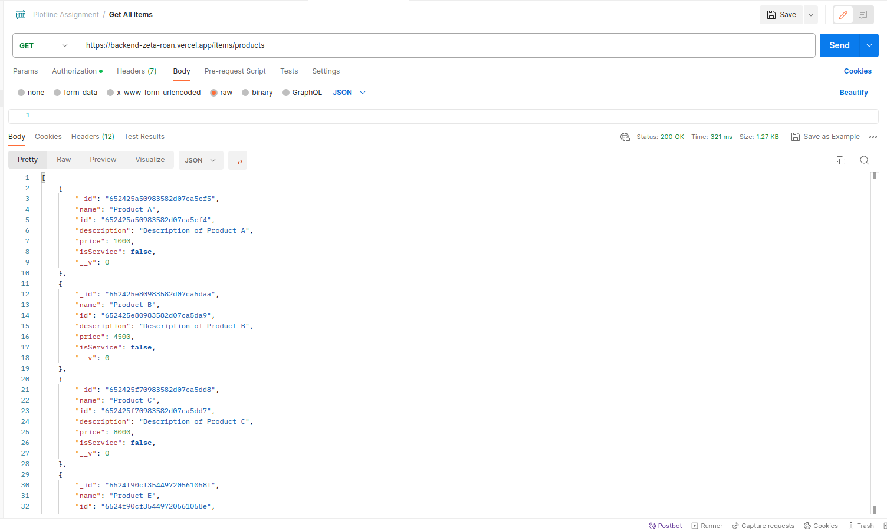
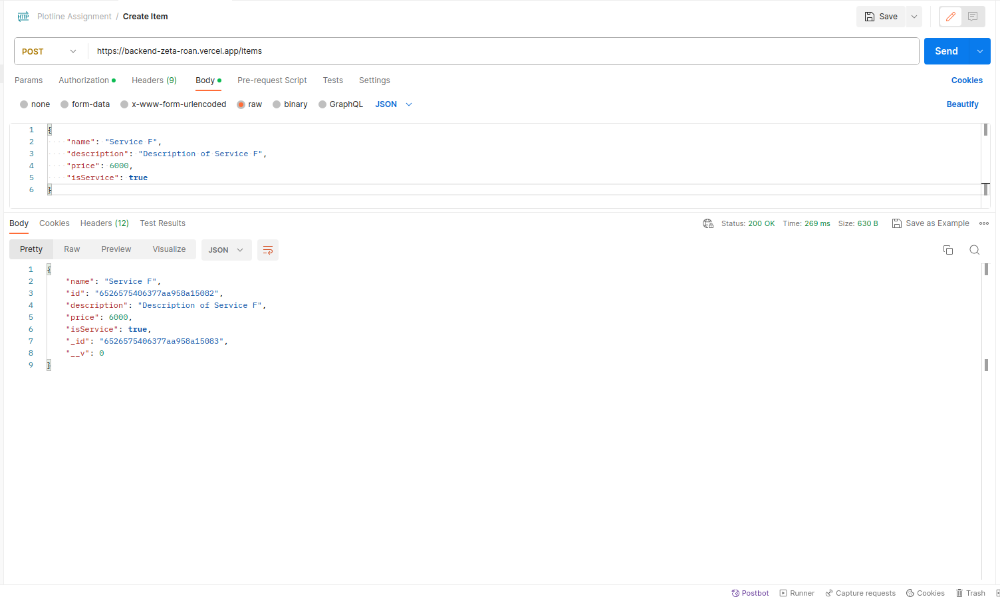
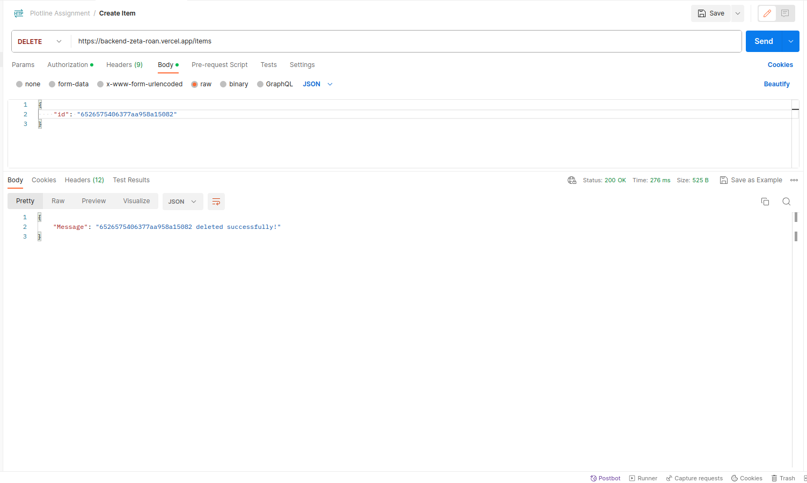
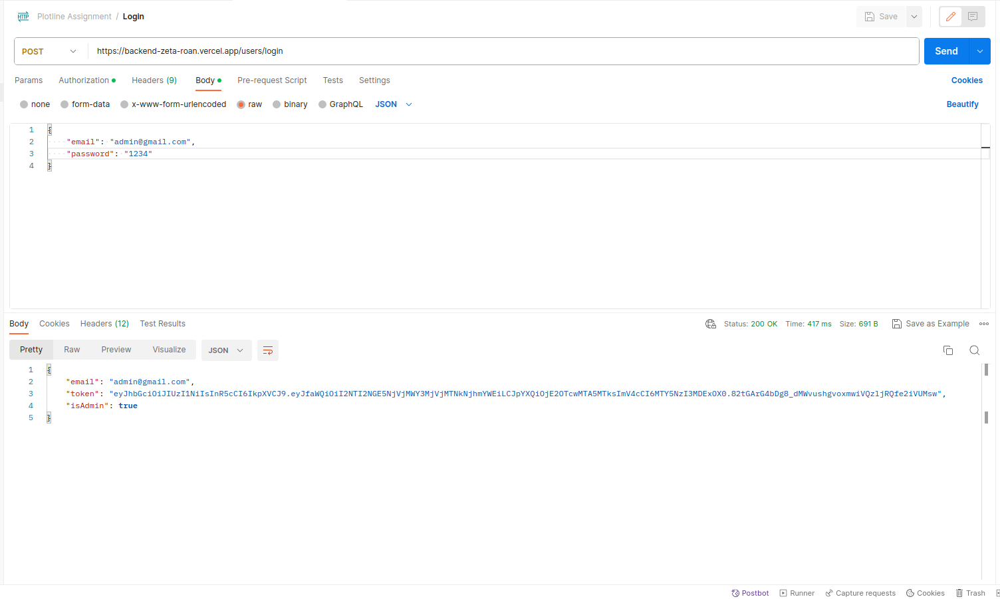
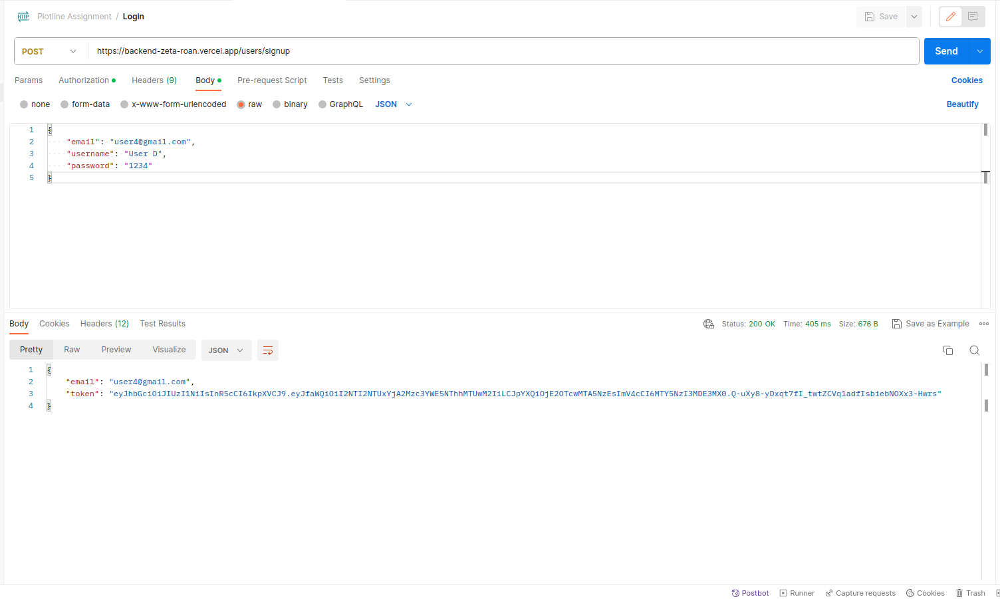
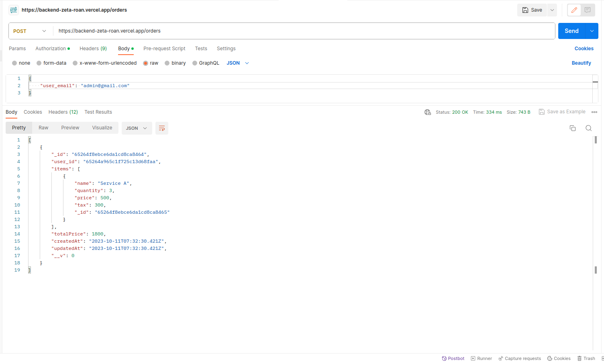
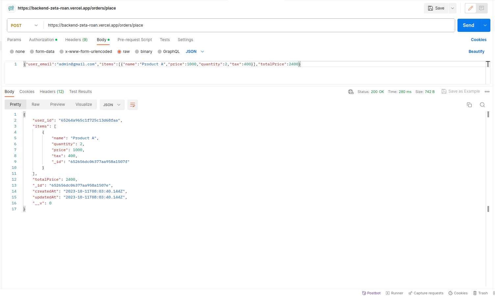
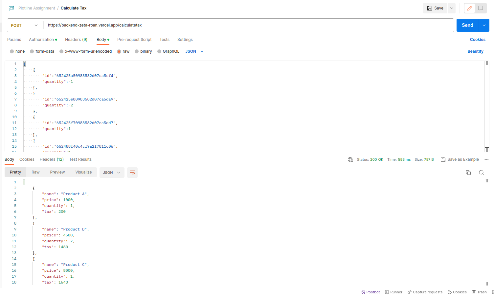

Hello! The following are the credentials to test out the application: 

## Application link
https://plotline-assignment-two.vercel.app/#/

## Credentials

### Admin Credentials: 

admin@gmail.com  Password: 1234

### User Credentials: 

user1@gmail.com Password: 1234 \
user2@gmail.com Password: 1234 \
user3@gmail.com Password: 1234

## Pages
The website has 6 pages:

1. Home: Contains the problem statement and checklist of requirements
2. Products: Displays all products stored on the application 
3. Services: Displays all services stored on the application 
4. Orders: Displays past orders made by current logged in user 
5. Cart: Displays current items in the cart
6. Create Items: A special page, which allows only the admin to create products or services

## Routes

There are *9 backend routes* that the website leverages:  

### Item Routes: 
1. /GET /items/products: This route gets all the products 

2. /GET /items/services: This route gets all the services

3. /POST /items/: This route is used to create items, either a product or service

4. /DEL /items/: This route is used to delete a specific item

### User Routes: 
5. /POST /users/login: Login route, used to log in the user to the website

6. /POST /users/signup: Used to sign up the user to the website

### Orders Routes: 
7. /POST /orders/: Used to get orders based on a user id

8. /POST /orders/place: Used to place an order on checkout

### Tax Routes: 
9. /POST /calculatetax: Used to calculate the tax on the current items in the cart based on the rules given in the assignment.

### User Authentication: 

User authentication is done by using Javascript Web Token. On logging in or signing up, a JWT token is created on the backend and the same information is stored in localStorage. 

Any HTTP request made by user to get or post is first validated by checking the correct JWT token. This is done by using a custom middleware that checks validates the JWT. If found invalid, it denies permission to the route.
